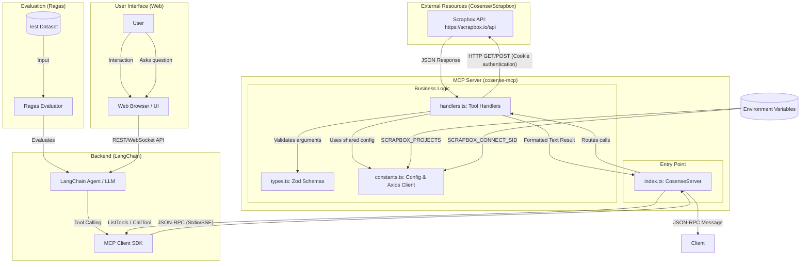

# Cosense MCP Server Architecture

This document describes the architecture and data flow of the `cosense-mcp` server.

## Architecture Diagram

## Component Breakdown

1.  **[index.ts](src/index.ts) (CosenseServer)**:
    *   Manages the MCP server lifecycle.
    *   Defines tools (metadata, input schemas) and exposes them to the client.
    *   Routes incoming tool requests to the appropriate handler.

2.  **[handlers.ts](src/handlers.ts)**:
    *   Implements the core logic for each tool (`get_page`, `create_page`, `search_pages`, `search_all`).
    *   Handles Scrapbox API interaction, data parsing, and response formatting.

3.  **[constants.ts](src/constants.ts)**:
    *   Loads and processes configuration from environment variables (`SCRAPBOX_PROJECTS`, `SCRAPBOX_CONNECT_SID`).
    *   Initializes the shared `axios` instance for API communication.

4.  **[types.ts](src/types.ts)**:
    *   Defines Zod schemas for validating tool input parameters.

5.  **LangChain Backend**:
    *   Hosts the AI Agent logic and orchestrates tool calling using MCP Client SDKs.

6.  **Web UI**:
    *   Provides the interface for the user to interact with the agent.

7.  **[evaluate/](evaluate/) (Ragas Evaluation)**:
    *   **config.py**: Defines evaluation metrics (Faithfulness, Relevancy, etc.) and model configurations.
    *   **run.py**: Main script to execute the evaluation process using the Ragas framework.
    *   **datasets/**: Contains JSON-formatted test cases (questions, ground truths, etc.).

## Data Flow

1.  The **User** interacts with the **Web Browser / UI**.
2.  The UI sends a request to the **LangChain Backend**.
3.  The **LangChain Agent** determines that it needs external information and selects a tool.
4.  The **MCP Client SDK** (within the backend) sends a tool call request to the MCP Server.
5.  **`index.ts`** receives the request and routes it to the correct function in **`handlers.ts`**.
6.  **`handlers.ts`** validates the arguments and makes HTTP requests to the **Scrapbox API**.
7.  The results are returned through the server to the backend.
8.  The **LangChain Agent** receives the tool output and generates a response for the **Web UI**.
9.  The **User** sees the final response in the browser.
