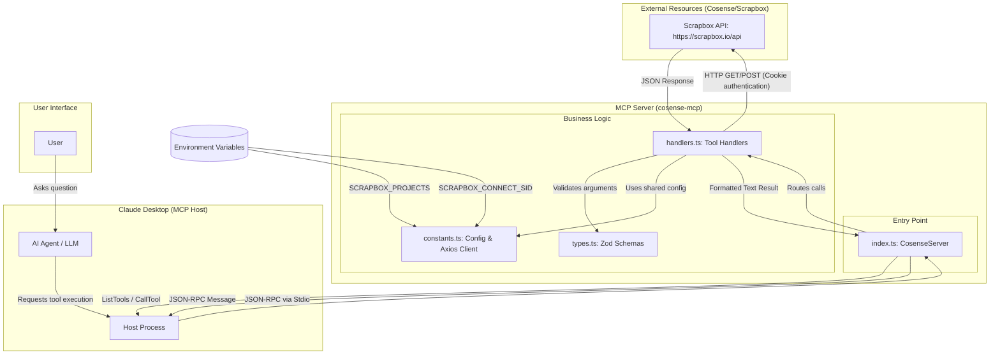

# Cosense MCP Server Architecture

This document describes the architecture and data flow of the `cosense-mcp` server.

## Architecture Diagram

## Component Breakdown

1.  **[index.ts](src/index.ts) (CosenseServer)**:
    *   Manages the MCP server lifecycle.
    *   Defines tools (metadata, input schemas) and exposes them to the client.
    *   Routes incoming tool requests to the appropriate handler.

2.  **[handlers.ts](src/handlers.ts)**:
    *   Implements the core logic for each tool (`get_page`, `create_page`, `search_pages`, `search_all`).
    *   Handles Scrapbox API interaction, data parsing, and response formatting.

3.  **[constants.ts](src/constants.ts)**:
    *   Loads and processes configuration from environment variables (`SCRAPBOX_PROJECTS`, `SCRAPBOX_CONNECT_SID`).
    *   Initializes the shared `axios` instance for API communication.

4.  **[types.ts](src/types.ts)**:
    *   Defines Zod schemas for validating tool input parameters.

## Data Flow

1.  The **User** asks a question or gives an instruction (e.g., "Search for project ideas in Cosense").
2.  The **AI Agent** (inside Claude Desktop) processes the natural language, determines that it needs external information, and selects the appropriate tool (e.g., `search_all`).
3.  The **MCP Host** (Claude Desktop process) sends a tool call request to the MCP Server via JSON-RPC.
4.  **`index.ts`** receives the request and routes it to the correct function in **`handlers.ts`**.
5.  **`handlers.ts`** validates the arguments using schemas from **`types.ts`** and makes HTTP requests to the **Scrapbox API** using the client from **`constants.ts`**.
6.  The results are formatted into text and returned through the server to the client.
7.  The **AI Agent** receives the tool output and generates a final response for the **User**.
